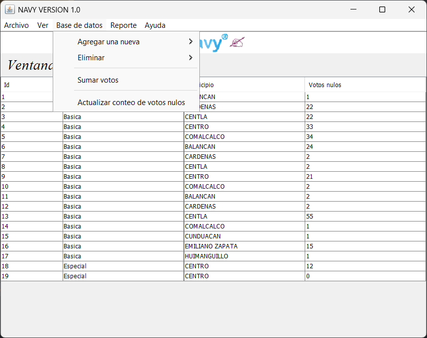
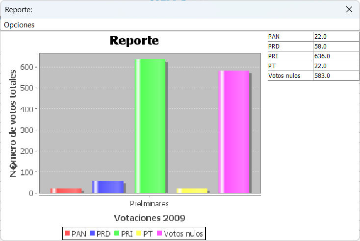

# Simulador de Captura de Votos en Java

Este proyecto educativo fue desarrollado como parte de un trabajo escolar universitario. Su objetivo principal es simular la captura de votos en casillas durante un proceso electoral estatal, utilizando Java como lenguaje de programación y una base de datos Microsoft Access (`.mdb`) para el almacenamiento de información. El sistema permite registrar votaciones por casilla y generar gráficas del conteo global de votos por partido político.
## 🧠 Objetivos del Proyecto

- Simular la dinámica de captura de resultados en casillas electorales.
- Registrar y almacenar los datos de votaciones en una base de datos.
- Facilitar el análisis de los resultados mediante gráficas.

## 🚀 Características Principales

- Registro de votaciones por casilla (número de votos por partido).
- Visualización del total de votos por partido a nivel estatal.
- Generación de gráficas representativas del conteo global.
- Conexión y consultas a base de datos Access (`.mdb`) mediante JDBC-ODBC.
- Interfaz gráfica sencilla desarrollada con Java Swing.

## 🛠️ Tecnologías Utilizadas

- **Java SE**
- **Java Swing** (para la interfaz gráfica de usuario)
- **JDBC-ODBC Bridge** (para la conexión con la base de datos Access)
- **Microsoft Access (.mdb)** como sistema de almacenamiento
- Se deben de implementar las siguientes librerías, para que sea compatible con Windows:
  commons-lang3-3.8.1.jar
  commons-logging-1.2.jar
  hsqldb-2.5.0.jar
  jackcess-3.0.1.jar
  ucanaccess-5.0.1.jar

## ⚙️ Información Técnica

- El código fue originalmente desarrollado en **2009** como parte de un proyecto académico.
- Ha sido **actualizado y revisado para ser compatible con Java 24 (JDK 24)**.
- Se utiliza únicamente la biblioteca estándar de Java, sin frameworks externos.

## 🧰 Requisitos

- **Java Development Kit (JDK) 24 o superior**
- Sistema operativo con soporte para Java (Windows, macOS o Linux)
- Librería **UCanAccess**. [Aquí el enlace de descarga desde sourceforge](https://sourceforge.net/projects/ucanaccess/).

## 🚀 Cómo usar

1. Clona este repositorio:
   ```bash
   git clone https://github.com/aldomontero/java_simulador_votos.git
   cd nombre-del-repositorio
   ```

2. Compila los archivos fuente:
   ```bash
   javac <nombre_del_archivo_clase>
   ```

3. Ejecuta la aplicación:
   ```bash
   java <nombre_de_clase>
   ```
## Capturas de pantalla

- Página principal.

- Gráfica de conteos.


> Asegúrate de tener todos los archivos `.java` necesarios en el mismo directorio o configurados correctamente en tu IDE.

## 📌 Notas

- Este proyecto tiene un valor **educativo e histórico**, y representa cómo se construían algunas aplicaciones en Java en la década de 2000.
- Si bien no sigue las prácticas modernas de desarrollo, es un excelente ejemplo clásico con interfaces gráficas.
